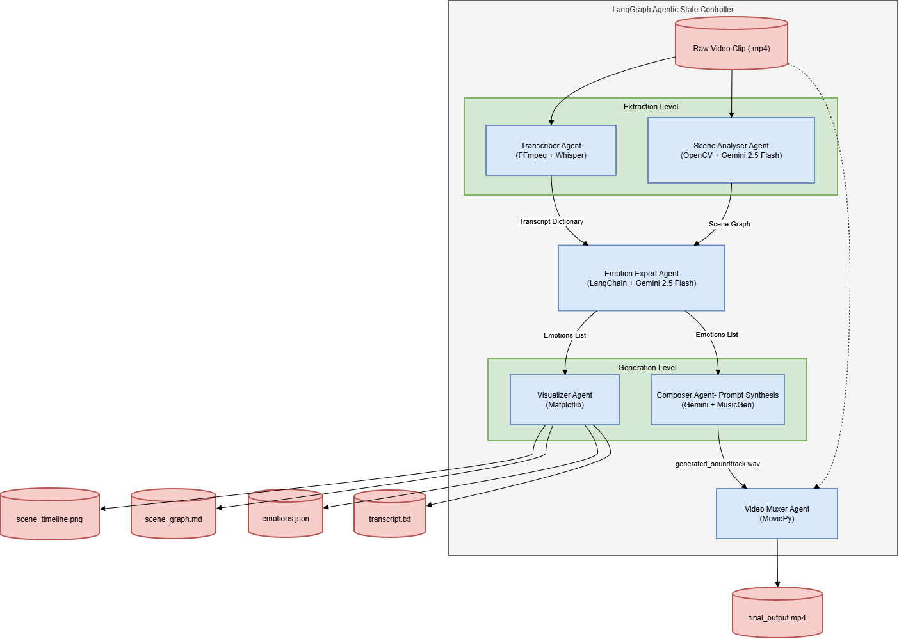

# bgmusic-ai

**An AI-driven, multimodal background music generator for video clips.**

*Built as part of the Generative AI and its Applications course by Aayush Kumar Singh, Dhruv Jain and Pranav Saxena*

---

## Description

`bgmusic-ai` is an advanced, autonomous multi-agent AI pipeline designed to act as a virtual film composer. It takes a raw video clip as input and completely scores it from scratch by actively analyzing *both* the visual events happening on screen and the dialogue being spoken. 

By mapping the chronological evolution of emotions in a scene, it dynamically synthesizes high-quality, emotionally resonant background music tailored perfectly to the pacing of the video.

## Target Audience

This tool solves genuine pain-points in modern digital media workflows. It is highly valuable for:

1. **Content Creators (YouTubers & Short Form Creators):** Drop in a raw timeline video and receive a perfectly timed, royalty-free background track without scrolling through audio libraries and cutting music.
2. **Video Editors & Directors:** Enables rapid emotional prototyping. Easily test how a scene feels if it's scored with "tension" vs "sadness", helping to find the right creative direction.
3. **Indie Game Developers:** Zero-budget auto-scoring for cutscenes. Generates a custom cinematic track that dynamically swells directly alongside critical on-screen action.
4. **Enterprise Marketing Teams:** Massively reduces turnaround time by automatically scoring bulk short-form ad content.

## Architecture



The application orchestrates a suite of specialized AI agents using a multi-agent state graph. The workflow executes as follows:

1. **Transcriber**: Extracts the audio track and generates a timestamped transcript of all spoken dialogue.
2. **Scene Analyst**: Processes the video visually, extracting frames every few seconds and generating a chronological "scene graph" of on-screen actions.
3. **Emotion Expert**: Acts as the semantic bridge. It ingests *both* the visual scene graph and the text transcript to predict the precise emotional state of the scene at any given second.
4. **Composer**: Synthesizes the full emotional timeline into a highly detailed prompt (e.g., "A cinematic score evolving from deep despair into urgent tension"), which is then used to generate the audio soundtrack.
5. **Video Muxer**: Automatically crossfades and loops the generated soundtrack, muxing it back onto the original video to produce a final, fully-scored MP4.
6. **Visualizer**: Concurrently generates markdown reports and matplotlib charts so you can see exactly why the AI chose the music it did.

## Technology Stack

- **Orchestration**: LangGraph, LangChain
- **Vision & LLM**: Google Gemini 2.5 Flash API
- **Audio Processing**: OpenAI Whisper (Local, Speech-to-Text), Meta MusicGen (Local via HuggingFace `transformers`, Text-to-Audio)
- **Computer Vision & Video**: OpenCV, MoviePy, FFmpeg

## Setup & Execution

### Prerequisites
- Python 3.10+
- An active `GEMINI_API_KEY`
- CUDA-enabled GPU (Highly recommended for running Whisper and MusicGen locally)

### Installation

1. **Clone the repository:**
   ```bash
   git clone https://github.com/aayushsingh12/bgmusic-ai.git
   cd bgmusic-ai
   ```

2. **Set up the environment:**
   Create a `.env` file in the root directory and add your key:
   ```env
   GEMINI_API_KEY=your_api_key_here
   ```

3. **Run the pipeline:**
   Drop a `.mp4` video file into the project directory. Open `src/main.py`, update the `video_path` variable to target your video, and run:
   ```bash
   python -m src.main
   ```

## Expected Output Files

After a successful run, the pipeline will output the following files:
- `final_output.mp4` - Your rescored video
- `generated_soundtrack.wav` - The raw, isolated music
- `scene_timeline.png` - A visual graph of the emotional arc
- `musicgen_prompt.txt` - The exact LLM-synthesized prompt sent to the music generator
- `emotions.json` - Raw timestamped emotion data
- `scene_graph.md` - A markdown breakdown of what the AI saw in the video
- `transcript.txt` - The extracted dialogue
